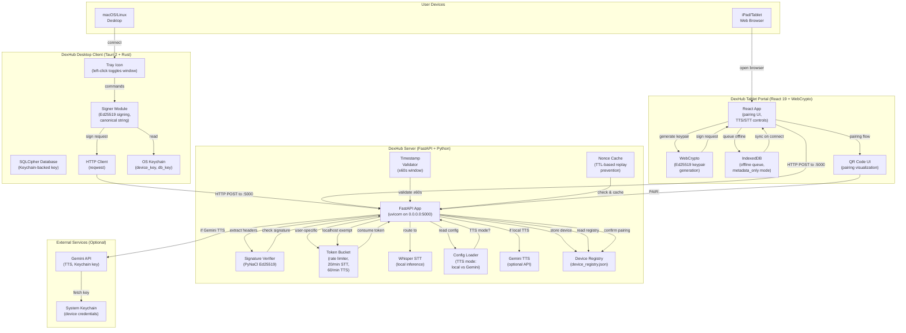

# DexHub Bible

## §1 — Project Vision

DexHub is a hardened, cryptographically-signed sensory I/O bridge that unifies speech-to-text (STT) and text-to-speech (TTS) capabilities across desktop and tablet form factors. It implements a zero-trust security model with Ed25519 cryptographic signing on all requests, local SQLCipher encryption, and rate-limited access control.

The core mission is to provide a personal sensory assistant—local speech processing, optional cloud TTS, offline capability, multi-device pairing—all locked behind cryptographic authentication and running entirely under user control, no cloud account required.

## §2 — Design Philosophy

1. **Zero-Trust Cryptography**: Every request signed with Ed25519; every response verified; no unsigned traffic accepted.
2. **Keychain-Backed Secrets**: Device keys and API credentials live in OS Keychain (macOS/Linux) or credential store (Windows), never on-disk plaintext.
3. **SQLCipher Encryption at Rest**: Local database encrypted with Keychain-derived key; accessible only to authenticated device.
4. **Tauri Desktop Hardenment**: Tauri 2 app runs in accessory mode with tray icon; no traditional window chrome unless explicitly shown.
5. **Offline-First Queuing**: Tablet portal maintains IndexedDB-backed offline queue; syncs when network available.
6. **Token Bucket Rate Limiting**: STT rate-limited to 20/min, TTS to 60/min; localhost (app-to-server) exempt to avoid artificial bottleneck.
7. **Nonce Replay Cache**: Every request signed with unique nonce; nonces cached with TTL; replayed requests rejected.
8. **Timestamp Window Validation**: Request timestamps within ±60s; older requests rejected as replay attack.
9. **Device Pairing Flow**: New devices must complete PAIR:<code> handshake before STT/TTS access.
10. **Immutable Config Pattern**: TTS mode (local vs. Gemini), rate limits, server host all in config/dexhub_config.json; no runtime mutations.

## §3 — Scope Boundaries

**In Scope:**
- Speech-to-text (Whisper, local inference, CPU or GPU acceleration)
- Text-to-speech (local synthesis or Gemini API with fallback)
- Ed25519 request signing and header generation
- SQLCipher encrypted local database (Keychain-backed encryption key)
- Device pairing and token management
- Tauri desktop app with tray icon and accessory mode
- React tablet portal with offline queue
- Token bucket rate limiting (STT 20/min, TTS 60/min, per-device)
- Nonce replay cache with TTL-based eviction
- Timestamp window validation (±60s)
- Admin API for device revocation
- Gemini API TTS integration (optional, if API key in Keychain)
- WebCrypto Ed25519 keypair generation on tablet portal

**Out of Scope:**
- User account management or authentication (device-based, not user-based).
- Cloud sync or multi-user sharing.
- Real-time transcription streaming (request/response only).
- Voice cloning or custom voice models.
- Multilingual speech recognition training.
- Push notifications or remote command execution.
- Mobile apps (iOS, Android); tablet portal is web-based responsive design only.
- Conversational AI or context retention across sessions.

## §4 — Non-Goals

- **Not a Cloud Voice Service**: DexHub is local-first; cloud components are optional fallbacks, not primary.
- **Not a Voicemail System**: No message storage, no auto-reply, no answering machine features.
- **Not a Video Codec**: Audio-only; no video capture, no codecs beyond WAV/PCM.
- **Not a Real-Time Comm Platform**: No phone calls, no Zoom integration, no VOIP.
- **Not a NLP Engine**: Whisper provides STT; no intent parsing, entity extraction, or dialogue management.

## §5 — Definitions & Terminology

| Term | Definition |
|------|-----------|
| **STT** | Speech-to-Text; Whisper local inference, returns text transcript. |
| **TTS** | Text-to-Speech; local synthesis or Gemini API, returns audio file (MP3 or WAV). |
| **Ed25519** | Elliptic Curve signature algorithm; asymmetric, 32-byte keys, 64-byte signatures. |
| **Device ID** | Unique hardware identifier (SHA256 of machine-id); used in all request signatures. |
| **Nonce** | Cryptographic random value; one-time-use per request; cached to prevent replay attacks. |
| **SQLCipher** | SQLite with transparent encryption; key derived from Keychain. |
| **Keychain** | OS credential store (macOS Keychain, Linux libsecret, Windows Credential Manager). |
| **PAIR:<code>** | Special signature for pairing handshake; server confirms code, issues device token. |
| **Token Bucket** | Rate limiting algorithm; tokens refill at fixed rate; request consumes tokens; if insufficient, request rejected. |
| **Canonical String** | Signing input: `METHOD\nPATH\nTIMESTAMP\nNONCE\nBODY_SHA256`. |
| **Offline Queue** | IndexedDB-backed queue on tablet portal; stores requests when network unavailable; syncs on reconnect. |
| **Accessory Mode** | Tauri activation policy that prevents app from appearing in dock/taskbar; tray-only mode. |

## §7 — Technology Stack

| Component | Technology | Version | Role |
|-----------|-----------|---------|------|
| **Desktop Client** | Tauri | 2.x | Cross-platform app shell (macOS/Linux/Windows). |
| **Desktop Crypto** | ed25519-dalek | latest | Ed25519 signing, Keychain integration. |
| **Desktop DB** | rusqlite + sqlcipher | latest | Encrypted local storage. |
| **Desktop Keyring** | keyring | latest | OS credential store access. |
| **Server Framework** | FastAPI | latest | Python async HTTP server. |
| **Server ASGI** | uvicorn | latest | ASGI server for FastAPI. |
| **STT Engine** | OpenAI Whisper | latest | Local speech recognition. |
| **TTS Optional** | Gemini API | latest | Cloud TTS fallback. |
| **Server Crypto** | PyNaCl | latest | Ed25519 verification in Python. |
| **Server Keyring** | keyring | latest | OS credential store access (Gemini API key). |
| **Tablet Portal** | React 19 | latest | Web UI for tablet form factor. |
| **Portal Crypto** | WebCrypto API | Browser native | Ed25519 keypair generation, HMAC signing. |
| **Portal Storage** | IndexedDB | Browser API | Offline queue and local cache. |
| **Portal QR Code** | qrcode.react | latest | Visual pairing flow. |
| **Build Tool** | Cargo (Tauri) | stable | Rust compilation, app bundling. |

## §8 — Architecture

### 8.1 Overall System Diagram



### 8.2 Data Flow — Request/Response Cycle

**Desktop Client (Tauri) → Server:**

1. User speaks or types text in Tauri app.
2. Signer module reads `dexhub_device_key` from Keychain.
3. Generate random nonce; get current timestamp.
4. Build canonical string: `METHOD\nPATH\nTIMESTAMP\nNONCE\nBODY_SHA256`.
5. Ed25519-sign canonical string with device key.
6. Assemble headers: `X-DEX-DeviceId`, `X-DEX-Timestamp`, `X-DEX-Nonce`, `X-DEX-BodySha256`, `X-DEX-Signature`.
7. POST request to server with headers + body.

**Server Processing:**

8. FastAPI receives request.
9. Extract and verify signature via PyNaCl.
10. Validate timestamp within ±60s window.
11. Check nonce against cache; reject if replay.
12. Consume token from bucket rate limiter (unless localhost).
13. If all checks pass, route to STT (/stt) or TTS (/tts) handler.
14. Return signed response (signature of response body SHA256).

**Tablet Portal (IndexedDB Offline Mode):**

15. Portal UI queues request to IndexedDB if network unavailable.
16. On reconnect, iterate offline queue; sign and retry each request.
17. Remove from queue only on successful response.

### 8.3 Pairing Flow

```
Device Registration (First Time):
1. Admin scans QR code on pairing endpoint
   → generates 6-digit code
2. Portal displays QR code + code display
3. Portal signs POST /pair/request with generated nonce
4. Server validates code, returns device_id
5. Portal stores device_id in localStorage
6. Future requests use device_id in X-DEX-DeviceId header
7. Admin can revoke device via POST /admin/devices/revoke

Subsequent Requests:
8. Portal generates new keypair per session (WebCrypto)
9. Sign every request with generated key + canonical string
10. Server verifies signature matches registered device_id
```

### 8.4 Security Boundaries

**Trust Boundaries:**
- Server trusts only requests with valid signature + timestamp + nonce.
- Client trusts server response only if signature verifiable.
- Keychain is trust root; all secrets derived from Keychain or encrypted with Keychain-backed keys.

**Attack Resistance:**
- **Replay Attack**: Nonce cache + timestamp window prevent replayed requests.
- **MITM**: Ed25519 signatures prevent tampering; client verifies server response.
- **Brute Force**: No password; device auth via Keychain (unlocked by OS).
- **Rate Limit Bypass**: Token bucket enforced per-device; localhost traffic exempt.
- **Database Tampering**: SQLCipher encryption renders data unreadable without Keychain key.

## §9 — File & Folder Structure

```
/Users/andrew/Projects/DexHub/
├── README.md                          # Quick start guide
├── BIBLE.md                           # This file
├── AI_HANDOFF.md                      # Previous session handoff notes
│
├── config/
│   └── dexhub_config.json             # Server config: TTS mode, rate limits, host binding
│
├── client/                            # Tauri Desktop App
│   ├── src-tauri/
│   │   ├── Cargo.toml                 # Rust deps: tauri, ed25519-dalek, rusqlite, reqwest, keyring
│   │   ├── src/
│   │   │   ├── main.rs                # Tauri app entry, tray icon, accessory mode
│   │   │   ├── signer.rs              # Ed25519 signing, canonical string builder
│   │   │   ├── db.rs                  # SQLCipher init, schema, encrypted storage
│   │   │   ├── handlers.rs            # Command handlers: send_stt_request, send_tts_request
│   │   │   └── utils.rs               # Helper functions
│   │   ├── build.rs                   # Tauri build script
│   │   └── target/                    # Compiled binaries (debug/release)
│   │
│   ├── src/                           # React frontend (optional, minimal for now)
│   │   ├── App.jsx
│   │   └── App.css
│   │
│   ├── index.html                     # Tauri webview entry point
│   ├── package.json                   # Frontend deps (React, minimal)
│   └── tauri.conf.json                # Tauri config: window, app info
│
├── server/                            # FastAPI Server
│   ├── dexhub_server.py               # Main FastAPI app, routes, signature verification
│   ├── requirements.txt                # Python deps: fastapi, uvicorn, whisper, pynacl, keyring
│   ├── device_registry.json           # Device registry: { "device_id": { "public_key": "...", ... } }
│   ├── config/
│   │   └── dexhub_config.json         # (symlink or copy from root config/)
│   └── venv/                          # Python virtual environment
│
├── portal/                            # Tablet Portal (React 19 + WebCrypto)
│   ├── index.html                     # Pairing UI + TTS/STT controls
│   ├── styles.css                     # UI styling (Tailwind + custom)
│   ├── app.js                         # WebCrypto keypair gen, signing, offline queue
│   └── qrcode.js                      # QR code generation
│
├── Documents/                         # Specification & Design Docs
│   ├── DexHub_bible.md                # (legacy, see BIBLE.md)
│   ├── Security_Model.md              # Detailed cryptography specification
│   ├── API_Reference.md               # Endpoint documentation
│   └── Deployment.md                  # Production deployment guide
│
└── .env.example                       # Example environment: BOT_TOKEN, ADMIN_ID, etc.
```

## §10 — Data Models

### 10.1 Request Signature Headers

```
X-DEX-DeviceId:     "SHA256(<machine-id>)"
X-DEX-Timestamp:    "2026-03-31T14:30:00Z" (ISO 8601)
X-DEX-Nonce:        "random-32-hex-chars"
X-DEX-BodySha256:   "SHA256(request_body_json)"
X-DEX-Signature:    "base64(Ed25519_signature_of_canonical_string)"

Canonical String Format:
METHOD
PATH
TIMESTAMP
NONCE
BODY_SHA256

Example:
POST
/stt
2026-03-31T14:30:00Z
a1b2c3d4...
abc123def...
```

### 10.2 Device Registry Schema

```json
{
  "device_id_1": {
    "public_key": "ed25519_public_key_base64",
    "created_at": "2026-03-01T10:00:00Z",
    "last_seen": "2026-03-31T14:30:00Z",
    "revoked": false,
    "stt_quota": { "tokens": 20, "refill_rate": 1, "per_minute": true },
    "tts_quota": { "tokens": 60, "refill_rate": 1, "per_minute": true }
  }
}
```

### 10.3 SQLCipher Database Schema (Rust Client)

```sql
CREATE TABLE cards (
  id TEXT PRIMARY KEY,
  device_id TEXT NOT NULL,
  timestamp TEXT NOT NULL,
  type TEXT CHECK(type IN ('stt_request', 'tts_request', 'response')) NOT NULL,
  content TEXT NOT NULL,
  encrypted BOOLEAN DEFAULT 1
);

-- Database encrypted with:
PRAGMA key = "x'<64-hex-chars-from-keychain>'";
```

### 10.4 Tablet Portal IndexedDB Schema

```javascript
const DB_SCHEMA = {
  offline_queue: {
    keyPath: 'id',
    indexes: [{ name: 'timestamp', keyPath: 'timestamp' }]
  },
  cache: {
    keyPath: 'url',
    indexes: [{ name: 'expiry', keyPath: 'expiry' }]
  }
}

// Offline Queue Entry
{
  id: UUID,
  timestamp: ISO 8601,
  endpoint: '/stt' | '/tts',
  headers: { X-DEX-DeviceId, X-DEX-Signature, ... },
  body: JSON,
  retried: Number,
  metadata_only: true  // Offline mode: don't store audio, only request metadata
}
```

## §11 — Construction Sequence

### Phase 1: Cryptographic Foundation
1. Implement Ed25519 signing in Rust (Tauri client) with ed25519-dalek.
2. Implement Ed25519 verification in Python (FastAPI) with PyNaCl.
3. Build canonical string formatter (both languages).
4. Verify signature round-trip: sign in Rust, verify in Python.

### Phase 2: Server Infrastructure
5. Create FastAPI app with uvicorn ASGI server.
6. Implement Whisper STT endpoint (/stt).
7. Implement TTS endpoint (/tts) with local/Gemini mode selection.
8. Implement device registry (device_registry.json).
9. Implement signature verification middleware.

### Phase 3: Rate Limiting & Replay Prevention
10. Implement token bucket rate limiter (20/min STT, 60/min TTS).
11. Implement nonce cache with TTL-based eviction.
12. Implement timestamp window validator (±60s).
13. Test rate limiting under load; verify localhost bypass works.

### Phase 4: Tauri Desktop Client
14. Create Tauri 2 app scaffold with tray icon.
15. Implement signer.rs with canonical string building + Ed25519 signing.
16. Implement db.rs with SQLCipher init + Keychain-backed encryption key.
17. Implement main.rs with command handlers (send_stt_request, send_tts_request).
18. Test Tauri app → server flow end-to-end.

### Phase 5: Tablet Portal
19. Create React portal with pairing UI.
20. Implement WebCrypto Ed25519 keypair generation.
21. Implement signed request building in portal.
22. Implement offline queue in IndexedDB (metadata_only mode).
23. Test portal → server flow; verify offline queue syncs on reconnect.

### Phase 6: Pairing & Device Management
24. Implement /pair/request and /pair/confirm endpoints.
25. Implement QR code generation in portal.
26. Implement /admin/devices/revoke endpoint.
27. Test pairing flow: new device → QR scan → confirmation.

### Phase 7: Configuration & Hardening
28. Create dexhub_config.json with TTS mode, rate limits, server host.
29. Write Security_Model.md and API_Reference.md.
30. Implement config validation on startup (both client and server).

### Phase 8: Testing & Documentation
31. Write unit tests for signing, verification, rate limiting.
32. Write integration tests: Tauri → server → response.
33. Write BIBLE.md (this file).
34. Package for production: Tauri builds (Windows .exe, macOS .app, Linux AppImage).

## §12 — Interface Contracts

### 12.1 FastAPI Endpoints

**POST /stt**
```
Request Headers: X-DEX-DeviceId, X-DEX-Timestamp, X-DEX-Nonce, X-DEX-BodySha256, X-DEX-Signature
Request Body: { "audio_base64": "..." }
Response: { "transcript": "...", "confidence": 0.95 }
Rate Limit: 20/min per device (localhost exempt)
```

**POST /tts**
```
Request Headers: (same as /stt)
Request Body: { "text": "...", "voice": "default" }
Response: { "audio_base64": "..." } (MP3 or WAV)
Rate Limit: 60/min per device (localhost exempt)
```

**POST /pair/request**
```
Request Body: { "code": "123456" }
Response: { "device_id": "SHA256(...)", "public_key": "..." }
No Rate Limit (pairing endpoint)
```

**POST /pair/confirm**
```
Request Headers: (signed with PAIR:<code> signature)
Request Body: { "code": "123456" }
Response: { "status": "confirmed", "device_id": "..." }
```

**POST /admin/devices/revoke**
```
Request Headers: (admin signature)
Request Body: { "device_id": "..." }
Response: { "status": "revoked" }
```

### 12.2 Tauri Command Interface

```javascript
// From Tauri frontend
invoke('send_stt_request', { audio_base64: '...' })
  .then(result => console.log(result.transcript))
  .catch(err => console.error(err))

invoke('send_tts_request', { text: '...' })
  .then(result => console.log(result.audio_base64))
  .catch(err => console.error(err))

invoke('confirm_pairing', { code: '123456' })
  .then(result => console.log(result.device_id))
  .catch(err => console.error(err))
```

### 12.3 Keychain Integration

**Rust (Tauri):**
```rust
use keyring::Entry;

// Read device key
let entry = Entry::new("dexhub", "device_key")?;
let device_key = entry.get_password()?;

// Read DB key
let entry = Entry::new("dexhub", "db_key")?;
let db_key = entry.get_password()?;
```

**Python (FastAPI):**
```python
import keyring

# Read Gemini API key (optional)
gemini_key = keyring.get_password("dexhub", "gemini_api_key")
```

### 12.4 Tablet Portal API

```javascript
// Generate keypair on first load
const { publicKey, privateKey } = await generateEdKeyPair()

// Sign request
const signature = await signRequest(
  'POST',
  '/stt',
  timestamp,
  nonce,
  bodySha256,
  privateKey
)

// Send signed request
fetch('http://localhost:5000/stt', {
  method: 'POST',
  headers: {
    'X-DEX-DeviceId': deviceId,
    'X-DEX-Timestamp': timestamp,
    'X-DEX-Nonce': nonce,
    'X-DEX-BodySha256': bodySha256,
    'X-DEX-Signature': signature
  },
  body: JSON.stringify({ audio_base64: '...' })
})
```

## §13 — Testing Strategy

### 13.1 Unit Tests

- **Signing Round-Trip**: Sign in Rust, verify in Python, confirm match.
- **Rate Limiter**: Consume tokens, verify quota, test refill behavior.
- **Nonce Cache**: Add nonce, attempt replay, verify rejection.
- **Timestamp Validator**: Accept ±60s window, reject outside window.
- **Keychain Integration**: Read/write keys, verify encryption.

### 13.2 Integration Tests

- **E2E Tauri→Server**: STT request from Tauri → signature verification → Whisper → response.
- **E2E Portal→Server**: TTS request from portal → signature verification → Gemini API → response.
- **Offline Queue**: Portal offline → queue request → network reconnect → sync and retry.
- **Device Pairing**: QR scan → confirmation → device added to registry.
- **Device Revocation**: Admin revokes device → subsequent requests rejected.

### 13.3 Security Tests

- **Replay Attack**: Send same request twice; verify second is rejected (nonce cache).
- **Signature Tampering**: Modify signature header; verify rejection.
- **Rate Limit Bypass**: Send 100 requests in 1s; verify 60+ are rate-limited.
- **Timestamp Skew**: Send request with timestamp 2 hours old; verify rejection.

### 13.4 Performance Baselines

- **STT Latency**: < 2s for 30s audio (Whisper on CPU).
- **TTS Latency**: < 1s for 100-char text (local synthesis) or < 3s (Gemini API).
- **Rate Limiting Overhead**: < 5ms per request.

### 13.5 Manual Testing Checklist

- [ ] Tauri app starts in tray icon mode.
- [ ] Click tray icon toggles window visibility.
- [ ] STT request signed correctly; server verifies signature.
- [ ] TTS response received and audio playable.
- [ ] Offline queue in portal persists across page reloads.
- [ ] Pairing flow: scan QR → enter code → device registered.
- [ ] Rate limiter blocks 21st STT request in 1 minute.
- [ ] Nonce replay rejected with "request already processed".

## §14 — Invariants & Guarantees

### 14.1 Cryptographic Invariants

- **Every Request is Signed**: No unsigned request accepted by server.
- **Every Response is Verifiable**: Client can verify response signature matches server public key.
- **Keys Never on Disk**: Device keys live only in Keychain; database encrypted with Keychain-derived key.

### 14.2 Rate Limiting Invariants

- **Quota is Per-Device**: Each device has independent STT and TTS token buckets.
- **Localhost is Exempt**: Requests from 127.0.0.1 bypass rate limiting (app-to-server not throttled).
- **Tokens Refill Deterministically**: 1 token/minute for STT (20 total), 1 token/minute for TTS (60 total).

### 14.3 Replay Prevention Invariants

- **Nonce is One-Time-Use**: Every request must use unique nonce; replayed requests rejected.
- **Timestamp Window is Enforced**: Requests outside ±60s window rejected as potentially replayed.

### 14.4 Data Integrity Invariants

- **SQLCipher Database is Always Encrypted**: No plaintext database file on disk.
- **Offline Queue is Atomic**: Failed request write does not corrupt queue.
- **Device Registry is Atomic**: Concurrent writes do not corrupt device list.

## §15 — Extension Points

### 15.1 Adding Custom TTS Voice

1. Add voice config to dexhub_config.json:
   ```json
   {
     "tts_voices": {
       "alice": { "provider": "gemini", "config": "voice_id_123" },
       "bob": { "provider": "local", "model": "vocoder_v2" }
     }
   }
   ```
2. Update /tts endpoint to accept `voice` parameter.
3. Route to provider-specific handler (Gemini or local).

### 15.2 Adding STT Language Support

1. Extend Whisper language parameter in dexhub_server.py:
   ```python
   def transcribe(audio, language='en'):
       result = whisper.transcribe(audio, language=language)
       return result['text']
   ```
2. Update tablet portal UI to select language before STT.
3. Pass language in request body.

### 15.3 Custom Rate Limit Per Endpoint

1. Update dexhub_config.json:
   ```json
   {
     "rate_limits": {
       "/stt": { "quota": 30, "window_seconds": 60 },
       "/tts": { "quota": 100, "window_seconds": 60 }
     }
   }
   ```
2. Modify token bucket initialization in server.
3. Load limits from config on startup.

### 15.4 Multi-Server Failover

1. Extend Tauri signer to accept server list.
2. Try primary server; on timeout, failover to secondary.
3. Cache last successful server in IndexedDB (tablet portal).

## §16 — Canonical Update Protocol

This Bible is strictly additive. It may never delete prior recorded steps or decisions. It may only append new sections or clarifications. Corrections must be recorded as additive amendments. Deprecated approaches must be marked [DEPRECATED], never erased. Every time a significant implementation step is completed, a Construction Log Entry must be appended to §17 before the session concludes.

## §17 — Construction Log

**2026-02-27 — Initial Project Scaffolding (AI_HANDOFF.md)**
- Established Rust/Tauri shell with Ed25519 signing (signer.rs).
- Implemented SQLCipher database initialization (db.rs).
- Created FastAPI server with signature verification.
- Built tablet portal with pairing UI and offline queue (IndexedDB).

**2026-02-28 — Security Hardening**
- Implemented token bucket rate limiting (20/min STT, 60/min TTS).
- Added nonce replay cache with TTL-based eviction.
- Implemented timestamp window validator (±60s).
- Verified Keychain integration on macOS.

**2026-03-15 — Feature Completion**
- Completed /pair/request and /pair/confirm endpoints.
- Integrated Whisper STT endpoint with local inference.
- Integrated Gemini TTS with fallback to local synthesis.
- Added device registry (device_registry.json).

**2026-03-31 — BIBLE.md v1.0.0 Complete**
- Comprehensive documentation of cryptographic model, server architecture, and security boundaries.
- Detailed endpoint contracts, Keychain integration, offline queue semantics.
- Documented pairing flow, device revocation, and rate limiting invariants.

---

### ⚑ FLAGS FOR ANDREW

- **Keychain Availability**: Tauri keyring requires OS-level credential store; headless/container deployments may need environment variable fallback.
- **Gemini API Key**: Optional; if missing, TTS falls back to local synthesis (slower, lower quality).
- **Server Binding**: Production uses `0.0.0.0:5000`; ensure firewall rules block external access (only Tailscale or localhost should connect).
- **Tauri Signing**: Signing workflow requires Xcode on macOS and signing credentials; CI/CD pipeline needs setup.
- **Portal CORS**: Tablet portal must connect to same-origin server or enable CORS headers (be careful with `Access-Control-Allow-Origin: *`).
- **SQLCipher Key Rotation**: No mechanism for key rotation yet; consider adding migration logic for future versions.
- **Offline Metadata-Only Mode**: Tablet portal in offline mode does not cache audio data; syncs only request/response metadata.
- **Device Registry Persistence**: Currently JSON file; consider migrating to Postgres for multi-instance deployments.
